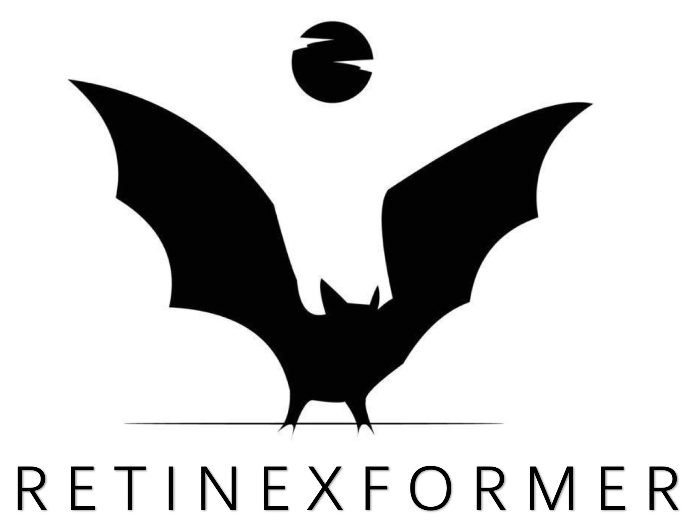

&nbsp;

<div align="center">
<p align="center">  </p>


[](https://arxiv.org/abs/2303.06705)
[](https://zhuanlan.zhihu.com/p/657927878)

[](https://paperswithcode.com/sota/low-light-image-enhancement-on-lol-v2-1?p=retinexformer-one-stage-retinex-based)
[](https://paperswithcode.com/sota/low-light-image-enhancement-on-mit-adobe-1?p=retinexformer-one-stage-retinex-based)

[](https://paperswithcode.com/sota/low-light-image-enhancement-on-sdsd-indoor?p=retinexformer-one-stage-retinex-based)
[](https://paperswithcode.com/sota/low-light-image-enhancement-on-sdsd-outdoor?p=retinexformer-one-stage-retinex-based)


[](https://paperswithcode.com/sota/low-light-image-enhancement-on-dicm?p=retinexformer-one-stage-retinex-based)
[](https://paperswithcode.com/sota/low-light-image-enhancement-on-lime?p=retinexformer-one-stage-retinex-based)


[](https://paperswithcode.com/sota/low-light-image-enhancement-on-smid?p=retinexformer-one-stage-retinex-based)
[](https://paperswithcode.com/sota/low-light-image-enhancement-on-sid?p=retinexformer-one-stage-retinex-based)


[](https://paperswithcode.com/sota/low-light-image-enhancement-on-mef?p=retinexformer-one-stage-retinex-based)
[](https://paperswithcode.com/sota/low-light-image-enhancement-on-npe?p=retinexformer-one-stage-retinex-based)


[](https://paperswithcode.com/sota/image-enhancement-on-mit-adobe-5k?p=retinexformer-one-stage-retinex-based)
[](https://paperswithcode.com/sota/low-light-image-enhancement-on-vv?p=retinexformer-one-stage-retinex-based)

[](https://paperswithcode.com/sota/low-light-image-enhancement-on-lol-v2?p=retinexformer-one-stage-retinex-based)
[](https://paperswithcode.com/sota/low-light-image-enhancement-on-lol?p=retinexformer-one-stage-retinex-based)


</div>


&nbsp;


### News
- **2023.11.03 :** The test setting of KinD, LLFlow, and recent diffusion models and the corresponding results on LOL are provided. Please note that we do not suggest this test setting because it uses the mean of the ground truth to obtain better results. But, if you want to follow KinD, LLFlow, and recent diffusion-based works for fair comparison, it is your choice to use this test setting. Please refer to the `Testing` part for details.
- **2023.11.02 :** Retinexformer is added to the [Awesome-Transformer-Attention](https://github.com/cmhungsteve/Awesome-Transformer-Attention/blob/main/README_2.md#image-restoration) collection. 💫
- **2023.10.20 :** Params and FLOPS evaluating function is provided. Feel free to check and use it.
- **2023.10.12 :** Retinexformer is added to the [ICCV-2023-paper](https://github.com/DmitryRyumin/ICCV-2023-Papers#low-level-and-physics-based-vision) collection. 🚀
- **2023.10.10 :** Retinexformer is added to the [low-level-vision-paper-record](https://github.com/lcybuzz/Low-Level-Vision-Paper-Record) collection. ⭐
- **2023.10.06 :** Retinexformer is added to the [awesome-low-light-image-enhancement](https://github.com/dawnlh/awesome-low-light-image-enhancement) collection. :tada:
- **2023.09.20 :** Some results on ExDark nighttime object detection are released.
- **2023.09.20 :** Code, models, results, and training logs have been released. Feel free to use them. ⭐
- **2023.07.14 :** Our paper has been accepted by ICCV 2023. Code and Models will be released. :rocket:

### Results
- Results on LOL-v1, LOL-v2-real, LOL-v2-synthetic, SID, SMID, SDSD-in, SDSD-out, and MIT Adobe FiveK datasets can be downloaded from [Baidu Disk](https://pan.baidu.com/s/1DC6A-I9S7yJ-pmMVTLAHaw?pwd=cyh2) (code: `cyh2`) or [Google Drive](https://drive.google.com/drive/folders/1UCpHh3MkV4bxzWgiiULnb3BOPWS_8crP?usp=drive_link)

- Results on LOL-v1, LOL-v2-real, and LOL-v2-synthetic datasets with the same test setting as KinD, LLFlow, and recent diffusion models can be downloaded from [Baidu Disk](https://pan.baidu.com/s/1Kbq9pASf1O_0Y9QMc88obQ?pwd=cyh2) (code: `cyh2`) or [Google Drive](https://drive.google.com/drive/folders/1_ugNFblIYOCIam4cVJiXVX1aBGEYhn1o?usp=drive_link).

- Results on LIME, NPE, MEF, DICM, and VV datasets can be downloaded from [Baidu Disk](https://pan.baidu.com/s/1cqBwmuXk83h6u1NZJVbfkg?pwd=cyh2) (code: `cyh2`) or [Google Drive](https://drive.google.com/drive/folders/1rWa_WRX5bqlW2HnBNMUGFKWrou7gIQpO?usp=drive_link)

- Results on ExDark nighttime object detection can be downloaded from [Baidu Disk](https://pan.baidu.com/s/1ZvoPzYQePRc80-o7rrJuRQ?pwd=cyh2) (code: `cyh2`) or [Google Drive](https://drive.google.com/drive/folders/1nZQnwKkGvswv--JunzgBLTXVRlOdcxb6?usp=sharing). Please use [this repo](https://github.com/cuiziteng/Illumination-Adaptive-Transformer/tree/main/IAT_high/IAT_mmdetection) to run experiments on the ExDark dataset


<details close>
<summary><b>Performance on LOL-v1, LOL-v2-real, LOL-v2-synthetic, SID, SMID, SDSD-in, and SDSD-out:</b></summary>


</details>

<details close>
<summary><b>Performance on LOL with the same test setting as KinD, LLFlow, and diffusion models:</b></summary>

|  Metric  |   LOL-v1    |  LOL-v2-real  |  LOL-v2-synthetic  |
| :----------------------------------------------------------: | :----------------------------------------------------------: | :----------------------------------------------------------: | :----------------------------------------------------------: |
| PSNR | 27.18 | 27.71 | 29.04 |
| SSIM | 0.850 | 0.856 | 0.939 |

Please note that we do not suggest this test setting because it uses the mean of the ground truth to obtain better results. But, if you want to follow KinD, LLFlow, and recent diffusion-based works, it is your choice to use this test setting. Please refer to the `Testing` part for details.

</details>


<details close>
<summary><b>Performance on MIT Adobe FiveK:</b></summary>


</details>


<details close>
<summary><b>Performance on LIME, NPE, MEF, DICM, and VV:</b></summary>


</details>


<details close>
<summary><b>Performance on ExDark Nighttime object detection:</b></summary>


</details>


&nbsp;


## 1. Create Environment

- Make Conda Environment
```
conda create -n Retinexformer python=3.7
conda activate Retinexformer
```

- Install Dependencies
```
conda install pytorch=1.11 torchvision cudatoolkit=11.3 -c pytorch
pip install matplotlib scikit-learn scikit-image opencv-python yacs joblib natsort h5py tqdm tensorboard
pip install einops gdown addict future lmdb numpy pyyaml requests scipy yapf lpips
```

- Install BasicSR
```
python setup.py develop --no_cuda_ext
```

&nbsp;

## 2. Prepare Dataset
Download the following datasets:

LOL-v1 [Baidu Disk](https://pan.baidu.com/s/1ZAC9TWR-YeuLIkWs3L7z4g?pwd=cyh2) (code: `cyh2`), [Google Drive](https://drive.google.com/file/d/1L-kqSQyrmMueBh_ziWoPFhfsAh50h20H/view?usp=sharing)

LOL-v2 [Baidu Disk](https://pan.baidu.com/s/1X4HykuVL_1WyB3LWJJhBQg?pwd=cyh2) (code: `cyh2`), [Google Drive](https://drive.google.com/file/d/1Ou9EljYZW8o5dbDCf9R34FS8Pd8kEp2U/view?usp=sharing)

SID [Baidu Disk](https://pan.baidu.com/share/init?surl=HRr-5LJO0V0CWqtoctQp9w) (code: `gplv`), [Google Drive](https://drive.google.com/drive/folders/1eQ-5Z303sbASEvsgCBSDbhijzLTWQJtR?usp=share_link&pli=1)

SMID [Baidu Disk](https://pan.baidu.com/share/init?surl=Qol_4GsIjGDR8UT9IRZbBQ) (code: `btux`), [Google Drive](https://drive.google.com/drive/folders/1OV4XgVhipsRqjbp8SYr-4Rpk3mPwvdvG)

SDSD-indoor [Baidu Disk](https://pan.baidu.com/s/1rfRzshGNcL0MX5soRNuwTA?errmsg=Auth+Login+Params+Not+Corret&errno=2&ssnerror=0#list/path=%2F) (code: `jo1v`), [Google Drive](https://drive.google.com/drive/folders/14TF0f9YQwZEntry06M93AMd70WH00Mg6)

SDSD-outdoor [Baidu Disk](https://pan.baidu.com/share/init?surl=JzDQnFov-u6aBPPgjSzSxQ) (code: `uibk`), [Google Drive](https://drive.google.com/drive/folders/14TF0f9YQwZEntry06M93AMd70WH00Mg6)

MIT-Adobe FiveK [Baidu Disk](https://pan.baidu.com/s/1ajax7N9JmttTwY84-8URxA?pwd=cyh2) (code:`cyh2`), [Google Drive](https://drive.google.com/file/d/11HEUmchFXyepI4v3dhjnDnmhW_DgwfRR/view?usp=sharing), [Official](https://data.csail.mit.edu/graphics/fivek/)

**Note:** 

(1) Please use [bandizip](https://www.bandisoft.com/bandizip/) to jointly unzip the `.zip` and `.z01` files of SMID, SDSD-indoor, and SDSD-outdoor 

(2) Please process the raw images of the MIT Adobe FiveK dataset following [the sRGB output mode](https://github.com/nothinglo/Deep-Photo-Enhancer/issues/38) or directly download and use the sRGB image pairs processed by us in the [Baidu Disk](https://pan.baidu.com/s/1ajax7N9JmttTwY84-8URxA?pwd=cyh2) (code:`cyh2`) and [Google Drive](https://drive.google.com/file/d/11HEUmchFXyepI4v3dhjnDnmhW_DgwfRR/view?usp=sharing)

(3) Please download the `text_list.txt` from [Google Drive](https://drive.google.com/file/d/199qrfizUeZfgq3qVjrM74mZ_nlacgwiP/view?usp=sharing) or [Baidu Disk](https://pan.baidu.com/s/1GQfaQLI6tvB0IrTMPOM_9Q?pwd=ggbh) (code: `ggbh`) and then put it into the folder `data/SMID/SMID_Long_np/`

<details close>
<summary><b> Then organize these datasets as follows: </b></summary>

```
    |--data   
    |    |--LOLv1
    |    |    |--Train
    |    |    |    |--input
    |    |    |    |    |--100.png
    |    |    |    |    |--101.png
    |    |    |    |     ...
    |    |    |    |--target
    |    |    |    |    |--100.png
    |    |    |    |    |--101.png
    |    |    |    |     ...
    |    |    |--Test
    |    |    |    |--input
    |    |    |    |    |--111.png
    |    |    |    |    |--146.png
    |    |    |    |     ...
    |    |    |    |--target
    |    |    |    |    |--111.png
    |    |    |    |    |--146.png
    |    |    |    |     ...
    |    |--LOLv2
    |    |    |--Real_captured
    |    |    |    |--Train
    |    |    |    |    |--Low
    |    |    |    |    |    |--00001.png
    |    |    |    |    |    |--00002.png
    |    |    |    |    |     ...
    |    |    |    |    |--Normal
    |    |    |    |    |    |--00001.png
    |    |    |    |    |    |--00002.png
    |    |    |    |    |     ...
    |    |    |    |--Test
    |    |    |    |    |--Low
    |    |    |    |    |    |--00690.png
    |    |    |    |    |    |--00691.png
    |    |    |    |    |     ...
    |    |    |    |    |--Normal
    |    |    |    |    |    |--00690.png
    |    |    |    |    |    |--00691.png
    |    |    |    |    |     ...
    |    |    |--Synthetic
    |    |    |    |--Train
    |    |    |    |    |--Low
    |    |    |    |    |   |--r000da54ft.png
    |    |    |    |    |   |--r02e1abe2t.png
    |    |    |    |    |    ...
    |    |    |    |    |--Normal
    |    |    |    |    |   |--r000da54ft.png
    |    |    |    |    |   |--r02e1abe2t.png
    |    |    |    |    |    ...
    |    |    |    |--Test
    |    |    |    |    |--Low
    |    |    |    |    |   |--r00816405t.png
    |    |    |    |    |   |--r02189767t.png
    |    |    |    |    |    ...
    |    |    |    |    |--Normal
    |    |    |    |    |   |--r00816405t.png
    |    |    |    |    |   |--r02189767t.png
    |    |    |    |    |    ...
    |    |--SDSD
    |    |    |--indoor_static_np
    |    |    |    |--input
    |    |    |    |    |--pair1
    |    |    |    |    |   |--0001.npy
    |    |    |    |    |   |--0002.npy
    |    |    |    |    |    ...
    |    |    |    |    |--pair2
    |    |    |    |    |   |--0001.npy
    |    |    |    |    |   |--0002.npy
    |    |    |    |    |    ...
    |    |    |    |     ...
    |    |    |    |--GT
    |    |    |    |    |--pair1
    |    |    |    |    |   |--0001.npy
    |    |    |    |    |   |--0002.npy
    |    |    |    |    |    ...
    |    |    |    |    |--pair2
    |    |    |    |    |   |--0001.npy
    |    |    |    |    |   |--0002.npy
    |    |    |    |    |    ...
    |    |    |    |     ...
    |    |    |--outdoor_static_np
    |    |    |    |--input
    |    |    |    |    |--MVI_0898
    |    |    |    |    |   |--0001.npy
    |    |    |    |    |   |--0002.npy
    |    |    |    |    |    ...
    |    |    |    |    |--MVI_0918
    |    |    |    |    |   |--0001.npy
    |    |    |    |    |   |--0002.npy
    |    |    |    |    |    ...
    |    |    |    |     ...
    |    |    |    |--GT
    |    |    |    |    |--MVI_0898
    |    |    |    |    |   |--0001.npy
    |    |    |    |    |   |--0002.npy
    |    |    |    |    |    ...
    |    |    |    |    |--MVI_0918
    |    |    |    |    |   |--0001.npy
    |    |    |    |    |   |--0002.npy
    |    |    |    |    |    ...
    |    |    |    |     ...
    |    |--SID
    |    |    |--short_sid2
    |    |    |    |--00001
    |    |    |    |    |--00001_00_0.04s.npy
    |    |    |    |    |--00001_00_0.1s.npy
    |    |    |    |    |--00001_01_0.04s.npy
    |    |    |    |    |--00001_01_0.1s.npy
    |    |    |    |     ...
    |    |    |    |--00002
    |    |    |    |    |--00002_00_0.04s.npy
    |    |    |    |    |--00002_00_0.1s.npy
    |    |    |    |    |--00002_01_0.04s.npy
    |    |    |    |    |--00002_01_0.1s.npy
    |    |    |    |     ...
    |    |    |     ...
    |    |    |--long_sid2
    |    |    |    |--00001
    |    |    |    |    |--00001_00_0.04s.npy
    |    |    |    |    |--00001_00_0.1s.npy
    |    |    |    |    |--00001_01_0.04s.npy
    |    |    |    |    |--00001_01_0.1s.npy
    |    |    |    |     ...
    |    |    |    |--00002
    |    |    |    |    |--00002_00_0.04s.npy
    |    |    |    |    |--00002_00_0.1s.npy
    |    |    |    |    |--00002_01_0.04s.npy
    |    |    |    |    |--00002_01_0.1s.npy
    |    |    |    |     ...
    |    |    |     ...
    |    |--SMID
    |    |    |--SMID_LQ_np
    |    |    |    |--0001
    |    |    |    |    |--0001.npy
    |    |    |    |    |--0002.npy
    |    |    |    |     ...
    |    |    |    |--0002
    |    |    |    |    |--0001.npy
    |    |    |    |    |--0002.npy
    |    |    |    |     ...
    |    |    |     ...
    |    |    |--SMID_Long_np
    |    |    |    |--text_list.txt
    |    |    |    |--0001
    |    |    |    |    |--0001.npy
    |    |    |    |    |--0002.npy
    |    |    |    |     ...
    |    |    |    |--0002
    |    |    |    |    |--0001.npy
    |    |    |    |    |--0002.npy
    |    |    |    |     ...
    |    |    |     ...
    |    |--FiveK
    |    |    |--train
    |    |    |    |--input
    |    |    |    |    |--a0099-kme_264.jpg
    |    |    |    |    |--a0101-kme_610.jpg
    |    |    |    |     ...
    |    |    |    |--target
    |    |    |    |    |--a0099-kme_264.jpg
    |    |    |    |    |--a0101-kme_610.jpg
    |    |    |    |     ...
    |    |    |--test
    |    |    |    |--input
    |    |    |    |    |--a4574-DSC_0038.jpg
    |    |    |    |    |--a4576-DSC_0217.jpg
    |    |    |    |     ...
    |    |    |    |--target
    |    |    |    |    |--a4574-DSC_0038.jpg
    |    |    |    |    |--a4576-DSC_0217.jpg
    |    |    |    |     ...

```

</details>

We also provide download links for LIME, NPE, MEF, DICM, and VV datasets that have no ground truth:

[Baidu Disk](https://pan.baidu.com/s/1oHg03tOfWWLp4q1R6rlzww?pwd=cyh2) (code: `cyh2`)
 or [Google Drive](https://drive.google.com/drive/folders/1RR50EJYGIHaUYwq4NtK7dx8faMSvX8Xp?usp=drive_link)


&nbsp;                    


## 3. Testing

Download our models from [Baidu Disk](https://pan.baidu.com/s/13zNqyKuxvLBiQunIxG_VhQ?pwd=cyh2) (code: `cyh2`) or [Google Drive](https://drive.google.com/drive/folders/1ynK5hfQachzc8y96ZumhkPPDXzHJwaQV?usp=drive_link). Put them in folder `pretrained_weights`

```shell
# LOL-v1
python3 Enhancement/test_from_dataset.py --opt Options/RetinexFormer_LOL_v1.yml --weights pretrained_weights/LOL_v1.pth --dataset LOL_v1

# LOL-v2-real
python3 Enhancement/test_from_dataset.py --opt Options/RetinexFormer_LOL_v2_real.yml --weights pretrained_weights/LOL_v2_real.pth --dataset LOL_v2_real

# LOL-v2-synthetic
python3 Enhancement/test_from_dataset.py --opt Options/RetinexFormer_LOL_v2_synthetic.yml --weights pretrained_weights/LOL_v2_synthetic.pth --dataset LOL_v2_synthetic

# SID
python3 Enhancement/test_from_dataset.py --opt Options/RetinexFormer_SID.yml --weights pretrained_weights/SID.pth --dataset SID

# SMID
python3 Enhancement/test_from_dataset.py --opt Options/RetinexFormer_SMID.yml --weights pretrained_weights/SMID.pth --dataset SMID

# SDSD-indoor
python3 Enhancement/test_from_dataset.py --opt Options/RetinexFormer_SDSD_indoor.yml --weights pretrained_weights/SDSD_indoor.pth --dataset SDSD_indoor

# SDSD-outdoor
python3 Enhancement/test_from_dataset.py --opt Options/RetinexFormer_SDSD_outdoor.yml --weights pretrained_weights/SDSD_outdoor.pth --dataset SDSD_outdoor

# FiveK
python3 Enhancement/test_from_dataset.py --opt Options/RetinexFormer_FiveK.yml --weights pretrained_weights/FiveK.pth --dataset FiveK
```


- #### The same test setting as LLFlow, KinD, and recent diffusion models
We provide the same test setting as LLFlow, KinD, and recent diffusion models. Please note that we do not suggest this test setting because it uses the mean of ground truth to enhance the output of the model. But if you want to follow this test setting, just add a `--GT_mean` action at the end of the above test command as

```shell
# LOL-v1
python3 Enhancement/test_from_dataset.py --opt Options/RetinexFormer_LOL_v1.yml --weights pretrained_weights/LOL_v1.pth --dataset LOL_v1 --GT_mean

# LOL-v2-real
python3 Enhancement/test_from_dataset.py --opt Options/RetinexFormer_LOL_v2_real.yml --weights pretrained_weights/LOL_v2_real.pth --dataset LOL_v2_real --GT_mean

# LOL-v2-synthetic
python3 Enhancement/test_from_dataset.py --opt Options/RetinexFormer_LOL_v2_synthetic.yml --weights pretrained_weights/LOL_v2_synthetic.pth --dataset LOL_v2_synthetic --GT_mean
```


- #### Evaluating the Params and FLOPS of models
We have provided a function `my_summary()` in `Enhancement/utils.py`, please use this function to evaluate the parameters and computational complexity of the models, especially the Transformers as

```shell
from utils import my_summary
my_summary(RetinexFormer(), 256, 256, 3, 1)
```


&nbsp;


## 4. Training

Feel free to check our training logs from [Baidu Disk](https://pan.baidu.com/s/16NtLba_ANe3Vzji-eZ1xAA?pwd=cyh2) (code: `cyh2`) or [Google Drive](https://drive.google.com/drive/folders/1HU_wEn_95Hakxi_ze-pS6Htikmml5MTA?usp=sharing)

```shell
# LOL-v1
python3 basicsr/train.py --opt Options/RetinexFormer_LOL_v1.yml

# LOL-v2-real
python3 basicsr/train.py --opt Options/RetinexFormer_LOL_v2_real.yml

# LOL-v2-synthetic
python3 basicsr/train.py --opt Options/RetinexFormer_LOL_v2_synthetic.yml

# SID
python3 basicsr/train.py --opt Options/RetinexFormer_SID.yml

# SMID
python3 basicsr/train.py --opt Options/RetinexFormer_SMID.yml

# SDSD-indoor
python3 basicsr/train.py --opt Options/RetinexFormer_SDSD_indoor.yml

# SDSD-outdoor
python3 basicsr/train.py --opt Options/RetinexFormer_SDSD_outdoor.yml

# FiveK
python3 basicsr/train.py --opt Options/RetinexFormer_FiveK.yml
```

&nbsp;


## 5. Citation

```shell
@InProceedings{Cai_2023_ICCV,
    author    = {Cai, Yuanhao and Bian, Hao and Lin, Jing and Wang, Haoqian and Timofte, Radu and Zhang, Yulun},
    title     = {Retinexformer: One-stage Retinex-based Transformer for Low-light Image Enhancement},
    booktitle = {Proceedings of the IEEE/CVF International Conference on Computer Vision (ICCV)},
    month     = {October},
    year      = {2023},
    pages     = {12504-12513}
}

@inproceedings{retinexformer,
  title={Retinexformer: One-stage Retinex-based Transformer for Low-light Image Enhancement},
  author={Yuanhao Cai and Hao Bian and Jing Lin and Haoqian Wang and Radu Timofte and Yulun Zhang},
  booktitle={ICCV},
  year={2023}
}
```

**Acknowledgment:** Our code is based on the [BasicSR](https://github.com/xinntao/BasicSR) toolbox. 

